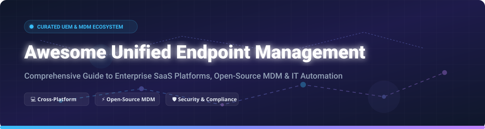

# Awesome Unified Endpoint Management (UEM) Ecosystem 🚀

A curated list of top-tier **SaaS platforms**, enterprise **Mobile Device Management (MDM)**, and **open-source GitHub projects** for **Unified Endpoint Management (UEM)**, IT fleet automation, remote monitoring, and security compliance across Windows, macOS, Linux, iOS, and Android. 💻📱🖥️

> **Last updated: October 2026** 📅

---

## 📑 Table of Contents
- [🌐 Market Landscape & Overview](#-market-landscape--overview)
- [🏢 SaaS & Commercial UEM Platforms](#-saas--commercial-uem-platforms)
- [🔓 Open-Source GitHub Projects](#-open-source-github-projects)
- [🤝 How to Contribute](#-how-to-contribute)
- [⚠️ Disclaimer & Security Best Practices](#%EF%B8%8F-disclaimer--security-best-practices)

---

## 🌐 Market Landscape & Overview

> 📊 **Estimated Market Size & Industry Concentration**: The global **Unified Endpoint Management (UEM)** market size is valued at approximately **$11.8 Billion in 2026** and is projected to reach over **$35 Billion by 2032** (CAGR of ~20%). The sector is **moderately fragmented**, dominated by tech giants (Microsoft, IBM, Omnissa/VMware, Citrix) alongside specialized enterprise platforms (Jamf, ManageEngine, Ivanti) and a rapidly growing ecosystem of open-source and developer-centric alternatives.

---

## 🏢 SaaS & Commercial UEM Platforms

The following table summarizes enterprise SaaS and commercial UEM solutions, sorted by **Company Size / Valuation (Descending)**:

| Product / Vendor | 🏢 Company Size / Valuation | 💰 Starting Pricing | 🎁 Free Tier / Trial Limit | 💻 Supported Platforms & Primary Use Cases |
| :--- | :--- | :--- | :--- | :--- |
| **[Microsoft Intune](https://www.microsoft.com/microsoft-intune)** | **~$3.1 Trillion** (Microsoft Market Cap) | **$8.00** / user / month (Plan 1) | **30-day free trial** (Includes test tenant options) | Windows, macOS, iOS, Android, Linux. Deep Entra ID & Microsoft 365 integration. |
| **[IBM Security MaaS360](https://www.ibm.com/products/maas360)** | **~$200+ Billion** (IBM Market Cap) | **$1.50** / device / month (Fast Start) | **30-day free trial** (Full feature access) | AI-driven threat management, mobile security & compliance across all OS types. |
| **[Citrix Endpoint Management](https://www.citrix.com/)** | **~$16.5 Billion** (CSG Parent Valuation) | **$4.00** / user / month (Standalone start) | **30-day free trial** (On request via sales demo) | Enterprise Workspace integration, microapps, containerized mobile app security. |
| **[ManageEngine Endpoint Central](https://www.manageengine.com/products/desktop-central/)** | **~$15 Billion** (Zoho Corp Valuation) | **$1.25** / endpoint / month | **Free for up to 25 devices** (Forever free plan); 30-day trial | Complete ITAM, patch management, software deployment, and remote control. |
| **[VMware Workspace ONE](https://www.vmware.com/products/workspace-one.html)** | **~$10 Billion** (Omnissa EUC Business) | **$3.00** / device / month | **30-day free trial** (Cloud evaluation instance) | Zero Trust access, virtual desktop integration (VDI), and multi-OS automation. |
| **[Ivanti (MobileIron)](https://www.ivanti.com/)** | **~$4.5 Billion** (Private Equity Valuation) | **$7.50** / device / month (Reported base) | **14-day free trial** (Custom demo environment) | Mobile threat defense (MTD), Zero Trust network access (ZTNA), & patch automation. |
| **[Jamf Pro](https://www.jamf.com/products/jamf-pro/)** | **~$4.1 Billion** (NASDAQ: JAMF Market Cap) | **$4.00** / iOS device/mo ($7.80/Mac/mo) | **14-day free trial** (Full feature evaluation) | The gold standard for Apple fleet management (macOS, iOS, iPadOS, tvOS). |
| **[SOTI MobiControl](https://soti.net/products/soti-mobicontrol/)** | **~$1.2 Billion** (Estimated Valuation) | **$3.25** / device / month | **30-day free trial** (Available upon signup) | Specialized in IoT, ruggedized Android/Linux hardware, logistics & retail fleets. |
| **[Hexnode UEM](https://www.hexnode.com/)** | **~$500 Million** (Mitsogo Inc. Valuation) | **$1.08** / device / month (Pro Plan) | **14-day free trial** (No credit card required) | Affordable cross-platform UEM, kiosk mode customization, & zero-touch deployment. |
| **[Cisco Meraki Systems Manager](https://meraki.cisco.com/)** | **~$300 Million** (Cisco Meraki Business unit) | **$3.00** / device / month | **14-day free trial** (Includes hardware trials) | Cloud-managed UEM deeply integrated with Meraki network infrastructure. |

---

## 🔓 Open-Source GitHub Projects

Below are top open-source device management platforms, remote control tools, and security frameworks sorted by **GitHub Star Count (Descending)**:

| Project | ⭐ Star Count Badge | 📜 License | 🎯 Description & Key Highlights |
| :--- | :--- | :--- | :--- |
| **[RustDesk](https://github.com/rustdesk/rustdesk)** |  | AGPL-3.0 | **Open-source remote desktop client & server alternative to TeamViewer**. Built in Rust with P2P encryption, self-hosted relay servers, and cross-platform remote control. |
| **[NetBox](https://github.com/netbox-community/netbox)** |  | Apache-2.0 | **Infrastructure resource modeling & IPAM/DCIM platform**. Serves as the single source of truth for network assets, IP addresses, hardware devices, and rack deployments. |
| **[Wazuh](https://github.com/wazuh/wazuh)** |  | GPL-2.0 | **Enterprise open-source security monitoring & EDR platform**. Provides file integrity monitoring, vulnerability detection, threat analysis, and security compliance alongside UEM agents. |
| **[Traccar](https://github.com/traccar/traccar)** |  | Apache-2.0 | **Open-source GPS tracking platform** for managing mobile fleets, vehicle telemetry, asset trackers, and personal devices with real-time mapping and geofencing. |
| **[Fleet](https://github.com/fleetdm/fleet)** |  | MIT / Commercial | **The leading open-source UEM platform built on osquery**. Used by Stripe, Uber, and Netflix. Features GitOps-native YAML management, live device queries, vulnerability scanning, and multi-OS enrollment. |
| **[Tactical RMM](https://github.com/amidaware/tacticalrmm)** |  | Custom / GPL | **Remote Monitoring & Management (RMM) tool built with Django, Vue, and Go**. Integrates MeshCentral for remote desktop access, script execution, automated patch management, and hardware checks. |
| **[MicroMDM](https://github.com/micromdm/micromdm)** |  | MIT | **Minimalist Apple MDM server framework** written in Go. Uses Apple's native Device Management API for enrollment and profile deployment on macOS and iOS. *(In maintenance mode)*. |
| **[NanoMDM](https://github.com/micromdm/nanomdm)** |  | MIT | **Active lightweight successor to MicroMDM**. Modular, high-performance Apple MDM protocol handler designed for high-scale enterprise deployments. |
| **[Headwind MDM](https://github.com/h-mdm/hmdm-server)** |  | Apache-2.0 | **Open-source Android MDM platform**. Offers custom launcher, dedicated kiosk mode, APK distribution, location tracking, and deep support for enterprise Android devices and custom AOSP ROMs. |
| **[OpenUEM](https://github.com/open-uem/openuem-console)** |  | Apache-2.0 | **Modern Go-based open-source UEM solution**. Designed for lightweight installation with standalone console and agent architecture for Windows, Linux, and macOS. |
| **[TheOpenEM](https://github.com/jdolny/Toems)** |  | GPL-3.0 | **Open Endpoint Manager (Toems)**. Specialized in open-source OS deployment, bare-metal disk imaging, software distribution, and remote administration. |

---

## 🤝 How to Contribute

Contributions are warmly welcomed! Help us keep this directory accurate and comprehensive. 🌟

1. 🍴 **Fork the repository**.
2. 📝 **Add or update entries** in `README.md` following the tabular format.
3. 📌 **Verify links and metrics**: Ensure factual descriptions, official documentation URLs, and valid GitHub repository paths.
4. 🚀 **Submit a Pull Request** with a concise description of your additions.

---

## ⚠️ Disclaimer & Security Best Practices

- 🛡️ **Data Privacy & Security**: UEM platforms possess elevated privileges over end-user devices. Self-hosted deployments require strict access controls, valid TLS certificates, and compliance with data privacy regulations (GDPR, CCPA).
- 📜 **Operational Overhead**: Open-source UEM tools eliminate licensing costs but demand operational infrastructure management—such as annual Apple Push Notification service (APNs) certificate renewals and OS patch tracking.
- 📱 **BYOD Policy Alignment**: Always maintain clear scope transparency when enforcing configuration profiles on personal devices.

---

  <b>Made with ❤️ for IT Administrators, Security Engineers, and Enterprise Fleet Operators.</b>

